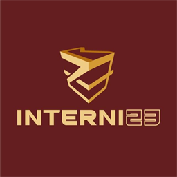

# internize.ai

<div align="center">
  
  <h3>Asisten AI Klinis Spesialis Penyakit Dalam (Sp.PD) & Penelitian Medis</h3>
  <p><strong>100% On-Device Privacy • Zero Egress • Clinical Shorthand Parser • FHIR R4 • HIPAA Safe Harbor</strong></p>

  <p>
    <a href="LICENSE"></a>
    
    
    
    
    
    
  </p>
</div>

---

## 🩺 Mengenai internize.ai

**internize.ai** adalah ekstensi peramban Google Chrome (Manifest V3) yang dirancang khusus untuk memfasilitasi alur kerja klinis dokter spesialis penyakit dalam (Sp.PD), residen/PPDS penyakit dalam, dokter umum, dan peneliti kesehatan di Indonesia.

Dibangun dengan filosofi **Clinician-in-the-Loop** dan **Zero Data Egress Invariant**:
- 🔒 **100% Pemrosesan On-Device**: Seluruh ekstraksi entitas klinis, interpretasi singkatan lab, kalkulasi skor risiko, dan de-identifikasi diproses secara lokal di browser via Transformers.js (WebGPU/WASM) atau deterministic clinical rule engine (CROGE).
- 🚫 **Tanpa Kebocoran Data (Zero Egress)**: Data sensitif pasien (*Protected Health Information* / PHI) tidak pernah dikirim ke server AI publik pihak ketiga mana pun.
- 👨‍⚕️ **Clinical Scaffolding Assistant**: Sistem ini adalah alat bantu kognitif dan percepatan administrasi medis; keputusan diagnosis dan terapi akhir tetap sepenuhnya di tangan Dokter Penanggung Jawab Pelayanan (DPJP).

---

## ✨ Fitur Unggulan

### 1. 📋 3 Mode Klinis Utama Sp.PD (Unified Switcher)
1. **Jawab Konsul TS**:
   - Preset asesmen terstruktur untuk *Pre-Operative Clearance*, *Rawat Bersama*, dan *Evaluasi Akut CITO*.
   - **Kalkulator Risiko Perioperatif Otomatis**:
     - Skor Kardiak **RCRI (Revised Cardiac Risk Index - Lee)** dengan risiko kejadian 30 hari.
     - Risiko Komplikasi Paru Pasca-Bedah **ARISCAT**.
     - Risiko Perdarahan **IMPROVE Bleeding Risk Score**.
     - Risiko Tromboemboli Vena (VTE) **Caprini Risk Score** / **Padua Score**.
   - **Target Kelaikan Tindakan Operasi Otomatis**: Tensi target (< 160/90 mmHg), Gula Darah (< 200 mg/dL), Status Ginjal, Hemoglobin (> 10 g/dL), Elektrolit Kalium (3.5 - 5.5 mmol/L), dan Status Fungsi Tiroid.
   - Tombol **1-Click Salin Draf Konsul 1-Kolom** siap tempel ke form EMR rumah sakit.
2. **Periksa Pasien (POMR)**:
   - Standarisasi *Problem Oriented Medical Record* (POMR) yang diklasifikasikan ke dalam **11 Divisi Subspesialisasi Organ PAPDI**:
     - *Endokrin-Metabolik, Ginjal-Hipertensi, Tropik-Infeksi, Kardiologi, Pulmonologi, Gastroenterohepatologi, Hematologi-Onkologi, Reumatologi, Alergi-Imunologi, Geriatri, dan Psikosomatik*.
   - Rincian rencana kerja berbasis pedoman nasional: **Pdx** (Diagnostik), **Ptx** (Terapi), **Pmx** (Monitoring), dan **Pex** (Edukasi).
   - Generator catatan perkembangan pasien terintegrasi (**SOAP CPPT**) komprehensif dalam bahasa medis Indonesia tanpa placeholder bahasa asing.
3. **Ringkas Kasus**:
   - Rangkuman kronologis problem aktif, riwayat penyakit terdahulu (RPD), riwayat pengobatan (RPO), dan sorotan lab kritis serial.

### 2. 🎗️ Engine Staging & Konversi Onkologi Medis (AJCC Ed. 8)
- **TNM Staging Parser**: Ekstraksi otomatis staging kanker (TNM klinis/patologis, misal `cT4bN3bM0` → **Stadium III C**; deteksi universal metastasis jauh `M1` → **Stadium IV**).
- **ECOG Performance Status**: Konversi otomatis skor status fungsional (misal `ECOG 2` / `PS 1`, atau *placeholder reminder* bila belum dievaluasi).
- **Riwayat Kemoterapi & Bedah**: Deteksi riwayat operasi (kolostomi, hemikolektomi, mastektomi) dan regimen kemoterapi (FOLFIRI, FOLFOX, AC-T, dsb.).
- **Pemisahan Komorbid**: Memisahkan komorbid medis umum (misal DM Tipe 2, Hipertensi) dari diagnosa utama kanker dan menautkan widget onkologi secara dinamis ke kartu masalah yang tepat.

### 3. 🇮🇩 Engine Parsing Singkatan Klinis Indonesia & Safety Guardrails
- **Disambiguasi Tanda Vital Shorthand**:
  - `T:` atau `TD:` → Tensi / Tekanan Darah (BUKAN temperatur).
  - `N:` atau `HR:` → Nadi / Frekuensi Jantung.
  - `R:` atau `RR:` → Laju Respirasi.
  - `S:` atau `Suhu:` → Suhu Tubuh (validasi rentang biologis 30°C - 45°C).
- **Anti-Collision Guard**:
  - `Vitamin K 10 mg` vs `Kalium` (mencegah alarm palsu hiperkalemia).
  - `CR: 2 detik` (*Capillary Refill Time*) vs `Kreatinin`.
- **Anti-Date Guard**: Mencegah tanggal pada header monitoring (contoh: `Monitoring BS:\n3/10/26`) tertangkap keliru sebagai nilai gula darah rendah (`GDS = 3`).
- **Multi-dot Thousand Formatting**: Mendukung pemisah ribuan titik khas Indonesia (contoh: `1.050.000 /uL` trombosit).
- **Anti-Hallucination Vital Guardrail**: Membersihkan klaim hipotensi/vital yang tidak didukung data pada teks rekam medis sumber.

### 4. 🔬 Riset & Standar Interoperabilitas Medis
- **18 Pengidentifikasi HIPAA Safe Harbor**: Redaksi otomatis nama pasien, NIK/nomor RM, nomor telepon Indonesia, tanggal lahir, dan alamat.
- **Standar Ontologi Internasional**:
  - Pemetaan diagnostik ke **SNOMED CT** (didukung deteksi negasi NegEx Indonesia).
  - Rekonsiliasi medikasi ke **RxNorm** (RxCUI, dosis, rute, frekuensi).
  - Ekstraksi biomarker laboratorium ke **LOINC** dengan unit standar UCUM.
  - Perakitan dan ekspor **FHIR R4 Bundle** (`transaction`) siap integrasi EMR/SatuSehat.

---

## 🚀 Cara Pasang Ekstensi (Tidak Perlu Keahlian Teknis!)

> Panduan ini dibuat sesederhana mungkin. Ikuti satu per satu, tidak akan salah! 😊

---

### 📥 Langkah 1 — Download File ZIP

1. Scroll ke atas halaman GitHub ini, klik file **[`internize.ai_fix_20261003_2037.zip`](internize.ai_fix_20261003_2037.zip)**.
2. Klik tombol **"Download raw file"** (ikon ⬇️ di kanan atas).
3. File ZIP akan tersimpan di folder **Downloads** komputer kamu.

---

### 📂 Langkah 2 — Ekstrak File ZIP

1. Buka folder **Downloads** di komputer kamu.
2. **Klik kanan** file `internize.ai_fix_20261003_2037.zip`.
3. Pilih **"Extract All..."** → klik **Extract**.
4. Akan muncul folder baru hasil ekstrak. Buka folder tersebut.
5. Di dalamnya ada folder bernama **`dist`** — **ingat lokasi folder `dist` ini**, kamu akan butuhkan di langkah berikutnya.

---

### 🌐 Langkah 3 — Pasang ke Google Chrome

1. Buka **Google Chrome** (pastikan sudah terinstall).
2. Di bagian **address bar** (kolom alamat website paling atas), ketik persis:
   ```
   chrome://extensions
   ```
   lalu tekan **Enter**.
3. Di **pojok kanan atas** halaman tersebut, nyalakan tombol **"Developer mode"** hingga berubah warna biru. *(Jangan khawatir, ini aman dan hanya untuk memasang ekstensi lokal.)*
4. Klik tombol **"Load unpacked"** yang muncul di **pojok kiri atas**.
5. Sebuah jendela pemilih folder akan terbuka — cari dan **pilih folder `dist`** yang tadi kamu ingat lokasinya.
6. Klik **"Select Folder"**.

✅ **Selesai!** Ikon **internize.ai** akan langsung muncul di Chrome kamu.

---

### 📌 Langkah 4 — Sematkan & Gunakan

1. Di pojok kanan atas Chrome, klik ikon **puzzle 🧩** (Extensions).
2. Cari **internize.ai**, lalu klik ikon **📌 pin** di sampingnya agar muncul permanen di toolbar.
3. Klik ikon **internize.ai** di toolbar → **Side Panel** akan terbuka di sisi kanan browser.
4. Tempel teks rekam medik pasien ke kotak input, atau sorot teks di halaman EMR rumah sakit untuk dianalisis otomatis.

---

> ⚠️ **Catatan:** Ekstensi ini berjalan **100% di komputer lokal kamu** — tidak ada data pasien yang dikirim ke internet. Aman dan sesuai privasi klinis.

---

## 💻 Panduan Pengembang (Developer Guide)

### Prasyarat
- **Node.js** `>= 18.0.0` (LTS v20.x direkomendasikan)
- **npm** `>= 9.0.0`
- **Google Chrome** `>= 116` (Manifest V3 Side Panel & WebGPU support)

### Setup & Menjalankan Mode Pengembangan

```bash
# 1. Clone repositori
git clone https://github.com/indra-dot/internize.ai.git
cd internize.ai

# 2. Install dependensi
npm install

# 3. Jalankan development server (HMR aktif)
npm run dev

# 4. Melakukan verifikasi tipe TypeScript
npx tsc --noEmit

# 5. Menjalankan linter Biome
npm run lint

# 6. Menjalankan test suite lengkap (223 E2E tests + unit tests)
npm test

# 7. Membangun output produksi
npm run build
```

---

## 🤝 Panduan Kontribusi (Contributing)

Kami sangat menyambut kontribusi dari rekan-rekan sejawat dokter, residen, software engineer, dan peneliti informatika medis!

Silakan baca panduan lengkap kontribusi di:
👉 **[CONTRIBUTING.md](CONTRIBUTING.md)**

### Ringkasan Alur Berkontribusi:
1. **Fork** repositori ini di GitHub.
2. Buat branch baru untuk fitur Anda:
   ```bash
   git checkout -b feat/nama-fitur-baru
   ```
3. Lakukan perubahan kode, protokol, atau kamus singkatan baru.
4. Pastikan semua pengujian lulus:
   ```bash
   npm test && npm run build
   ```
5. Commit perubahan Anda:
   ```bash
   git commit -m "feat: tambahkan protokol krisis hipertensi emergensi"
   ```
6. Push ke branch Anda dan buka **Pull Request** ke branch `master`!

---

## 📁 Struktur Repositori

```text
internize.ai/
├── .github/
│   └── workflows/ci.yml       # GitHub Actions CI automated testing & build
├── manifest.json              # Chrome Manifest V3 extension configuration
├── sidepanel.html             # Entry point HTML tampilan side panel
├── package.json               # Dependensi & NPM scripts
├── vite.config.ts             # Konfigurasi Vite & CRX plugin
├── CONTRIBUTING.md            # Panduan kontribusi komunitas & klinisi
├── LICENSE                    # Lisensi Open-Source MIT
├── README.md                  # Dokumentasi utama proyek
├── src/
│   ├── background/            # Chrome Service Worker (lifecycle & IPC)
│   ├── content/               # Content script penangkap seleksi teks EMR
│   ├── sidepanel/             # Entry point React 18, styling, navigation
│   ├── components/            # Komponen UI modular (Header, Card, Modal, Button)
│   ├── features/
│   │   ├── clinical/          # Tab Layanan Klinis, POMR, Pre-Op, Onkologi, SOAP
│   │   ├── research/          # HIPAA De-identification, LOINC, FHIR Bundle
│   │   └── settings/          # Konfigurasi lokal & sinkronisasi opsional
│   ├── services/
│   │   ├── clinical/          # Internal Medicine Engine, Staging Onkologi, CROGE
│   │   │   └── protocols/     # Protokol krisis PAPDI, kalkulator risiko (RCRI, ARISCAT)
│   │   ├── deid/              # De-identifier HIPAA Safe Harbor (18 pengidentifikasi)
│   │   ├── loinc/             # Kamus biomarker LOINC & ekstraksi lab
│   │   ├── fhir/              # Perakitan resource & bundle FHIR R4
│   │   └── storage/           # Wrapper chrome.storage lokal & cache
│   └── types/                 # Definisi tipe data TypeScript
└── tests/
    ├── unit/                  # Unit tests (Anti-hallucination, Onkologi, Guardrail, Shorthand)
    └── e2e/                   # E2E acceptance suite (Tier 1-4, 223 skenario klinis)
```

---

## 🛡️ Kebijakan Privasi & Batasan Tanggung Jawab Medis

- **Zero Egress Invariant**: Seluruh teks medis dan data pasien diproses secara lokal di browser komputer pengguna tanpa pernah dikirim ke cloud AI pihak ketiga.
- **Bantuan Pendamping (Clinical Decision Support)**: Sistem ini ditujukan sebagai pendamping kognitif dan asisten administratif klinis. Rekomendasi yang dihasilkan tidak menggantikan anamnesis, pemeriksaan fisik langsung, atau pertimbangan klinis independen dari dokter yang merawat.

---

## 📄 Lisensi

Proyek ini dirilis secara open-source di bawah ketentuan [MIT License](LICENSE).

<div align="center">
  <sub>Dibangun dengan dedikasi untuk kemajuan pelayanan medis dan penelitian penyakit dalam di Indonesia 🇮🇩</sub>
</div>
